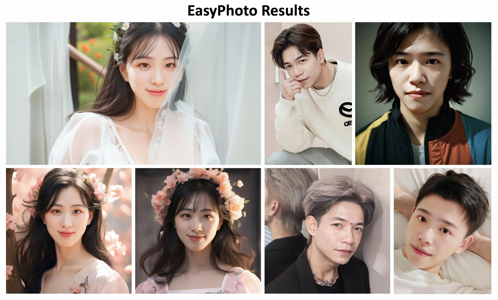
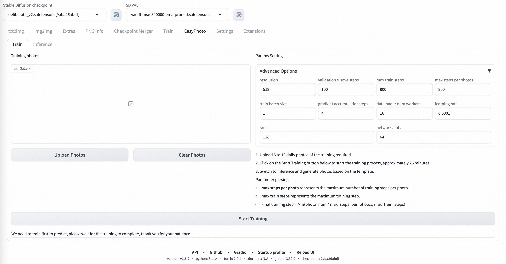
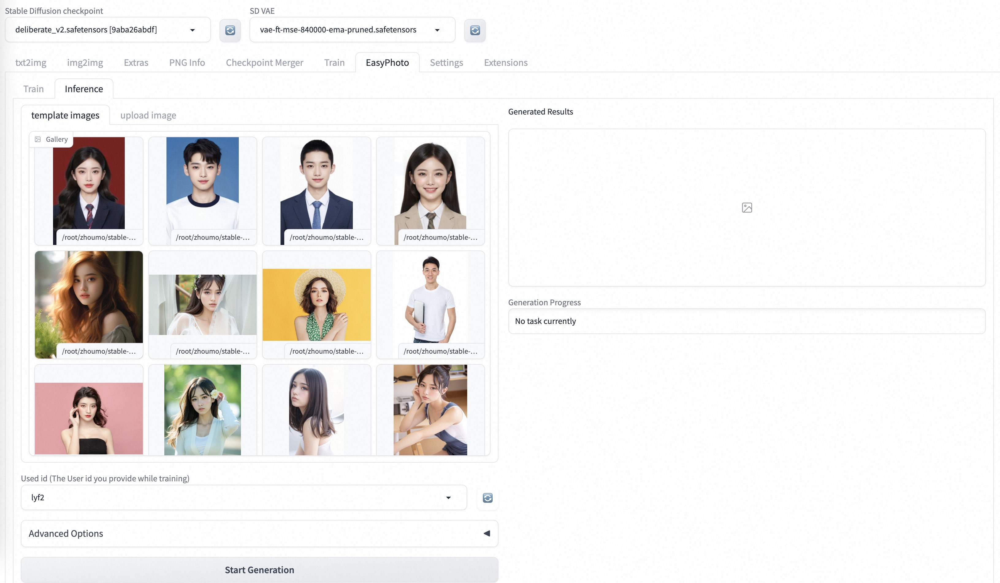

# 📷 EasyPhoto | Your Smart AI Photo Generator.
🦜 EasyPhoto is a Webui UI plugin for generating AI portraits that can be used to train digital doppelgangers relevant to you. 

🦜 🦜 Welcome!

[](https://huggingface.co/spaces/alibaba-pai/easyphoto)

English | [简体中文](./README_zh-CN.md)

# Table of Contents
- [Introduction](#introduction)
- [TODO List](#todo-list)
- [Quick Start](#quick-start)
    - [1. Cloud usage: AliyunDSW/AutoDL/Docker](#1-cloud-usage-aliyundswautodldocker)
    - [2. Local install: Check/Downloading/Installation](#2-local-install-environment-checkdownloadinginstallation)
- [How to use](#how-to-use)
    - [1. Model Training](#1-model-training)
    - [2. Inference](#2-inference)
- [API test](./api_test/README.md)
- [Algorithm Detailed](#algorithm-detailed)
    - [1. Architectural Overview](#1-architectural-overview)
    - [2. Training Detailed](#2-training-detailed)
    - [3. Inference Detailed](#3-inference-detailed)
- [Reference](#reference)
- [Related Project](#Related-Project)
- [License](#license)
- [ContactUS](#contactus)

# Introduction
EasyPhoto is a Webui UI plugin for generating AI portraits that can be used to train digital doppelgangers relevant to you. Training is recommended to be done with 5 to 20 portrait images, preferably half-body photos and do not wear glasses (It doesn't matter if the characters in a few pictures wear glasses). After the training is done, we can generate it in the Inference section. We support using preset template images or uploading your own images for Inference.    

Please read our Contributor Covenant [covenant](./COVENANT.md) | [简体中文](./COVENANT_zh-CN.md).   

If you meet some problems in the training, please refer to the [VQA](https://github.com/aigc-apps/sd-webui-EasyPhoto/wiki).   

We now support quick pull-ups from different platforms, refer to [Quick Start](#quick-start).

Now you can experience EasyPhoto demo quickly on ModelScope, [demo](https://modelscope.cn/studios/PAI/EasyPhoto/summary).

What's New:
- ComfyUI Support at [repo](https://github.com/THtianhao/ComfyUI-Portrait-Maker), thanks to [THtianhao](https://github.com/THtianhao) great work![🔥 🔥 🔥 2023.10.17]
- EasyPhoto arxiv [arxiv](https://arxiv.org/abs/2310.04672)[🔥 🔥 🔥 2023.10.10]
- Support SDXL to generate High resolution template, no more upload image need in this mode(SDXL), need 16GB GPU memory! Specific details can go [here](https://zhuanlan.zhihu.com/p/658940203)[🔥 🔥 🔥 2023.09.26]
- We also support the [Diffusers Edition](https://github.com/aigc-apps/EasyPhoto/). [🔥 2023.09.25]
- **Support fine-tuning the background and calculating the similarity score between the generated image and the user.** [🔥🔥 2023.09.15]
- **Support different base models for training and inference.** [🔥🔥 2023.09.08]
- **Support multi-people generation! Add cache option to optimize inference speed. Add log refreshing on UI.** [🔥🔥 2023.09.06]
- Create Code! Support for Windows and Linux Now. [🔥 2023.09.02]

These are our generated results:



Our ui interface is as follows:  
**train part:**

**inference part:**


# TODO List
- Support chinese ui.
- Support change in template's background.
- Support high resolution.

# Quick Start
### 1. Cloud usage: AliyunDSW/AutoDL/Docker
#### a. From AliyunDSW
DSW has free GPU time, which can be applied once by a user and is valid for 3 months after applying.

Aliyun provide free GPU time in [Freetier](https://help.aliyun.com/document_detail/2567864.html), get it and use in Aliyun PAI-DSW to start EasyPhoto within 3min!

[](https://gallery.pai-ml.com/#/preview/deepLearning/cv/stable_diffusion_easyphoto)

#### b. From AutoDL
If you are using AutoDL, you can quickly pull up the Stable DIffusion webui using the mirror we provide.

You can select the desired mirror by filling in the following information in Community Mirrors.
```
aigc-apps/sd-webui-EasyPhoto/sd-webui-EasyPhoto
```

#### c. From docker 
If you are using docker, please make sure that the graphics card driver and CUDA environment have been installed correctly in your machine.  

Then execute the following commands in this way:
```
# pull image
docker pull mybigpai-registry.cn-beijing.cr.aliyuncs.com/aigc/sd-webui-easyphoto:0.0.3

# enter image
docker run -it -p 7860:7860 --network host --gpus all mybigpai-registry.cn-beijing.cr.aliyuncs.com/aigc/sd-webui-easyphoto:0.0.3

# launch webui
python3 launch.py --port 7860
```
The docker updates may be slightly slower than the github repository of sd-webui-EasyPhoto, so you can go to extensions/sd-webui-EasyPhoto and do a git pull first. 
```
cd extensions/sd-webui-EasyPhoto/
git pull
cd /workspace
```

### 2. Local install: Environment Check/Downloading/Installation
#### a. Environment Check
We have verified EasyPhoto execution on the following environment:  
If you meet problem with WebUI auto killed by OOM, please refer to [ISSUE21](https://github.com/aigc-apps/sd-webui-EasyPhoto/issues/21), and setting some `num_threads` to `0` and report other fix to us, thanks.

The detailed of Windows 10:  
- OS: Windows10
- python: py3.10
- pytorch: torch2.0.1
- tensorflow-cpu: 2.13.0
- CUDA: 11.7
- CUDNN: 8+
- GPU: Nvidia-3060 12G

The detailed of Linux:  
- OS: Ubuntu 20.04, CentOS
- python: py3.10 & py3.11
- pytorch: torch2.0.1
- tensorflow-cpu: 2.13.0
- CUDA: 11.7
- CUDNN: 8+
- GPU: Nvidia-A10 24G & Nvidia-V100 16G & Nvidia-A100 40G

We need about 60GB available on disk (for saving weights and datasets process), please check!

#### b.  Relevant Repositories & Weights Downloading
##### i. Controlnet 
We need to use Controlnet for inference. The related repo is [Mikubill/sd-webui-controlnet](https://github.com/Mikubill/sd-webui-controlnet). You need install this repo before using EasyPhoto.

In addition, we need at least three Controlnets for inference. So you need to set the **Multi ControlNet: Max models amount (requires restart)** in Setting.


##### ii. Other Dependencies.
We are mutually compatible with the existing stable-diffusion-webui environment, and the relevant repositories are installed when starting stable-diffusion-webui.

The weights we need will be downloaded automatically when you start training first time.

#### c. Plug-in Installation
We now support installing EasyPhoto from git. The url of our Repository is `https://github.com/aigc-apps/sd-webui-EasyPhoto`.

We will support installing EasyPhoto from **Available** in the future.


# How to use
### 1. Model Training
The EasyPhoto training interface is as follows:

- On the left is the training image. Simply click `Upload Photos` to upload the image, and click `Clear Photos` to delete the uploaded image;
- On the right are the training parameters, which cannot be adjusted for the first training.

After clicking `Upload Photos`, we can start uploading images. **It is best to upload 5 to 20 images here, including different angles and lighting conditions**. It is best to have some images that do not include glasses. If they are all glasses, the generated results may easily generate glasses.


Then we click on `Start Training` below, and at this point, we need to fill in the `User ID` above, such as the user's name, to start training.


After the model starts training, the webui will automatically refresh the training log. If there is no refresh, click `Refresh Log` button.


If you want to set parameters, the parsing of each parameter is as follows:

|Parameter Name | Meaning|
|--|--|
|Resolution | The size of the image fed into the network during training, with a default value of `512`|
|Validation & save steps | The number of steps between validating the image and saving intermediate weights, with a default value of `100`, representing verifying the image every `100` steps and saving the weights|
|Max train steps | Maximum number of training steps, default value is `800`|
|Max steps per photos | The maximum number of training sessions per image, default to `200`|
|Train batch size | The batch size of the training, with a default value of `1`|
|Gradient accumulation steps | Whether to perform gradient accumulation. The default value is `4`. Combined with the train batch size, each step is equivalent to feeding four images|
|Dataloader num workers | The number of jobs loaded with data, which does not take effect under Windows because an error will be reported if set, but is set normally on Linux|
|Learning rate | Train Lora's learning rate, default to `1e-4`|
|Rank Lora | The feature length of the weight, default to `128`|
|Network alpha | The regularization parameter for Lora training, usually half of the rank, defaults to `64`|

### 2. Inference 
#### a. single people
- Step 1: Click the refresh button to query the model corresponding to the trained user ID.
- Step 2: Select the `user ID`.
- Step 3: Select the template that needs to be generated.
- Step 4: Click the Generate button to generate the results.


#### b. multi people
- Step 1: Go to the settings page of EasyPhoto and set `num_of_faceid` is greater than `1`.
- Step 2: Apply settings.
- Step 3: Restart the ui interface of the webui.
- Step 4: Return to EasyPhoto and upload the two person template.
- Step 5: Select the user IDs of two people.
- Step 6: Click the `Generate` button. Perform image generation.


# Algorithm Detailed
- Arxiv paper EasyPhoto [arxiv](https://arxiv.org/abs/2310.04672)
- More detailed principles and details can be found [BLOG](https://blog.csdn.net/weixin_44791964/article/details/132922309)


### 1. Architectural Overview


In the field of AI portraits, we expect model-generated images to be realistic and resemble the user, and traditional approaches introduce unrealistic lighting (such as face fusion or roop). To address this unrealism, we introduce the image-to-image capability of the stable diffusion model. Generating a perfect personal portrait takes into account the desired generation scenario and the user's digital doppelgänger. We use a pre-prepared template as the desired generation scene and an online trained face LoRA model as the user's digital doppelganger, which is a popular stable diffusion fine-tuning model. We use a small number of user images to train a stable digital doppelgänger of the user, and generate a personal portrait image based on the face LoRA model and the expected generative scene during inference. 

### 2. Training Detailed


First, we perform face detection on the input user image, and after determining the face location, we intercept the input image according to a certain ratio. Then, we use the saliency detection model and the skin beautification model to obtain a clean face training image, which basically consists of only faces. Then, we label each image with a fixed label. There is no need to use a labeler here, and the results are good. Finally, we fine-tune the stabilizing diffusion model to get the user's digital doppelganger.   

During training, we utilize the template image for verification in real time, and at the end of training, we calculate the face id gap between the verification image and the user's image to achieve Lora fusion, which ensures that our Lora is a perfect digital doppelganger of the user.

In addition, we will choose the image that is most similar to the user in the validation as the face_id image, which will be used in Inference.

### 3. Inference Detailed
#### a. First Diffusion:  
First, we will perform face detection on our incoming template image to determine the mask that needs to be inpainted for stable diffusion. then we will use the template image to perform face fusion with the optimal user image. After the face fusion is completed, we use the above mask to inpaint (fusion_image) with the face fused image. In addition, we will affix the optimal face_id image obtained during training to the template image by affine transformation (replaced_image). Then we will apply Controlnets on it, we use canny with color to extract features for fusion_image and openpose for replaced_image to ensure the similarity and stability of the images. Then we will use Stable Diffusion combined with the user's digital split for generation.

#### b. Second Diffusion:
After getting the result of First Diffusion, we will fuse the result with the optimal user image for face fusion, and then we will use Stable Diffusion again with the user's digital doppelganger for generation. The second generation will use higher resolution.

# Special thanks
Special thanks to DevelopmentZheng, qiuyanxin, rainlee, jhuang1207, bubbliiiing, wuziheng, yjjinjie, hkunzhe, yunkchen for their code contributions (in no particular order).

# Reference
- insightface：https://github.com/deepinsight/insightface    
- cv_resnet50_face：https://www.modelscope.cn/models/damo/cv_resnet50_face-detection_retinaface/summary  
- cv_u2net_salient：https://www.modelscope.cn/models/damo/cv_u2net_salient-detection/summary 
- cv_unet_skin_retouching_torch：https://www.modelscope.cn/models/damo/cv_unet_skin_retouching_torch/summary   
- cv_unet-image-face-fusion：https://www.modelscope.cn/models/damo/cv_unet-image-face-fusion_damo/summary  
- kohya：https://github.com/bmaltais/kohya_ss
- controlnet-webui：https://github.com/Mikubill/sd-webui-controlnet

# Related Project
We've also listed some great open source projects as well as any extensions you might be interested in:
- [ModelScope](https://github.com/modelscope/modelscope).
- [FaceChain](https://github.com/modelscope/facechain).
- [sd-webui-controlnet](https://github.com/Mikubill/sd-webui-controlnet).
- [sd-webui-roop](https://github.com/s0md3v/sd-webui-roop).
- [roop](https://github.com/s0md3v/roop).
- [sd-webui-deforum](https://github.com/deforum-art/sd-webui-deforum).
- [sd-webui-additional-networks](https://github.com/kohya-ss/sd-webui-additional-networks).
- [a1111-sd-webui-tagcomplete](https://github.com/DominikDoom/a1111-sd-webui-tagcomplete).
- [sd-webui-segment-anything](https://github.com/continue-revolution/sd-webui-segment-anything).
- [sd-webui-tunnels](https://github.com/Bing-su/sd-webui-tunnels).
- [sd-webui-mov2mov](https://github.com/Scholar01/sd-webui-mov2mov).

# License

This project is licensed under the [Apache License (Version 2.0)](https://github.com/modelscope/modelscope/blob/master/LICENSE).

# ContactUS
1. Use [Dingding](https://www.dingtalk.com/) to search group `38250008552` or Scan to join
2. Since the WeChat group is full, you need to scan the image on the right to add this student as a friend first, and then join the WeChat group.

<figure>


</figure>
