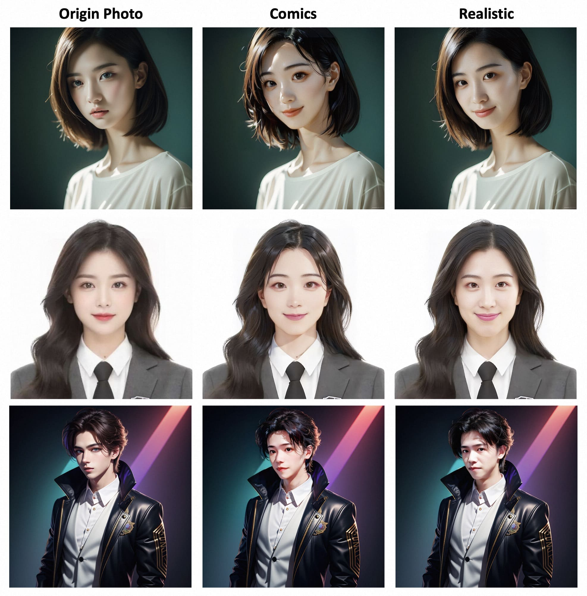
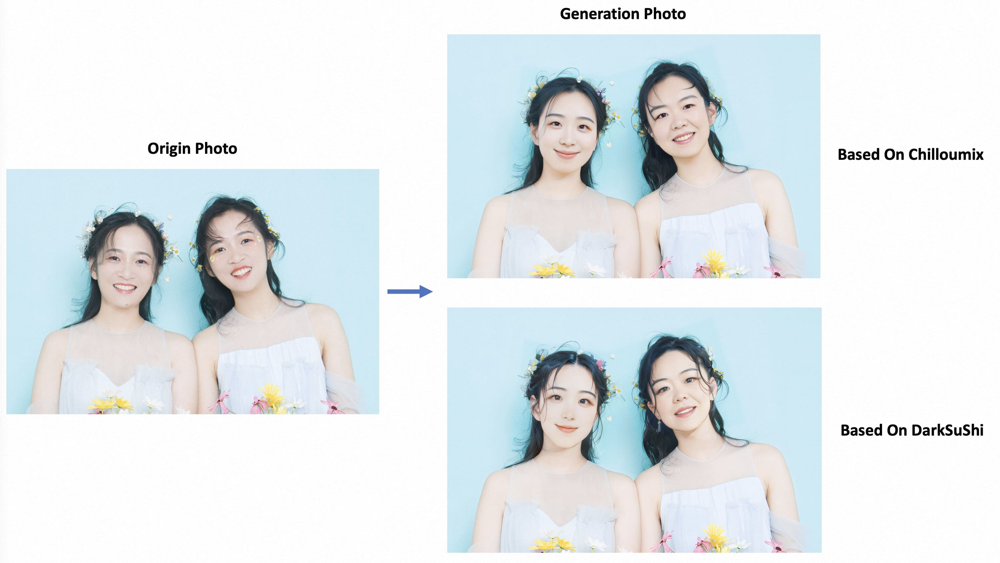

# EasyPhoto | 您的智能 AI 照片生成器。
🦜 EasyPhoto是一款Webui UI插件，用于生成AI肖像画，该代码可用于训练与您相关的数字分身。

🦜 🦜 Welcome!

[English](./README.md) | 简体中文

# 目录
- [简介](#简介)
- [TODO List](#todo-list)
- [快速启动](#快速启动)
    - [1. 云使用: AliyunDSW/AutoDL/Docker](#1-云使用-aliyundswautodldocker)
    - [2. 本地安装: 环境检查/下载/安装](#2-本地安装-环境检查下载安装)
- [如何使用](#如何使用)
    - [1. 模型训练](#1-模型训练)
    - [2. 人物生成](#2-人物生成)
- [算法详细信息](#算法详细信息)
    - [1. 架构概述](#1-架构概述)
    - [2. 训练细节](#2-训练细节)
    - [3. 推理细节](#3-推理细节)
- [参考文献](#参考文献)
- [相关项目](#相关项目)
- [许可证](#许可证)
- [联系我们](#联系我们)

# 简介
EasyPhoto是一款Webui UI插件，用于生成AI肖像画，该代码可用于训练与您相关的数字分身。建议使用 5 到 20 张肖像图片进行训练，最好是半身照片且不要佩戴眼镜（少量可以接受）。训练完成后，我们可以在推理部分生成图像。我们支持使用预设模板图片与上传自己的图片进行推理。  

请阅读我们的开发者公约，共建美好社区 [covenant](./COVENANT.md) | [简体中文](./COVENANT_zh-CN.md)

如果您在训练中遇到一些问题，请参考 [VQA](https://github.com/aigc-apps/sd-webui-EasyPhoto/wiki)。  

我们现在支持从不同平台快速启动，请参阅 [快速启动](#快速启动)。

新特性：
- **支持对背景进行微调，并计算生成的图像与用户之间的相似度得分。** [🔥🔥 2023.09.15]
- **支持不同预测基础模型。** [🔥🔥 2023.09.08]
- **支持多人生成！添加缓存选项以优化推理速度。在UI上添加日志刷新。** [🔥🔥 2023.09.06]
- 创建代码！现在支持 Windows 和 Linux。[🔥 2023.09.02]

这些是我们的生成结果:


 

我们的ui界面如下:  
**训练部分:**

**预测部分:**


# TODO List
- 支持中文界面。
- 支持模板背景部分变化。
- 支持高分辨率。

# 快速启动
### 1. 云使用: AliyunDSW/AutoDL/Docker
#### a. 通过阿里云 DSW
DSW 有免费 GPU 时间，用户可申请一次，申请后3个月内有效。

只需点击下面的链接进入，按笔记本即可，大约3-5分钟即可启动。

DSW Notebook：https://gallery.pai-ml.com/#/preview/deepLearning/cv/stable_diffusion_easyphoto

#### b. 通过AutoDL
如果您正在使用 AutoDL，您可以使用我们提供的镜像快速启动 Stable DIffusion webui。

您可以在社区镜像中填写以下信息来选择所需的镜像。
```
aigc-apps/sd-webui-EasyPhoto/sd-webui-EasyPhoto
```
#### c. 通过docker
使用docker的情况下，请保证机器中已经正确安装显卡驱动与CUDA环境，然后以此执行以下命令：
```
# 拉取镜像
docker pull mybigpai-registry.cn-beijing.cr.aliyuncs.com/aigc/sd-webui-easyphoto:0.0.3

# 进入镜像
docker run -it -p 7860:7860 --network host --gpus all mybigpai-registry.cn-beijing.cr.aliyuncs.com/aigc/sd-webui-easyphoto:0.0.3

# 启动webui
python3 launch.py --port 7860
```

### 2. 本地安装: 环境检查/下载/安装
#### a. 环境检查
我们已验证EasyPhoto可在以下环境中执行：  
如果你遇到内存使用过高而导致WebUI进程自动被kill掉，请参考[ISSUE21](https://github.com/aigc-apps/sd-webui-EasyPhoto/issues/21)，设置一些参数，例如num_threads=0，如果你也发现了其他解决的好办法，请及时联系我们。

Windows 10 的详细信息：  
- 操作系统： Windows10
- python: python 3.10
- pytorch: torch2.0.1
- tensorflow-cpu: 2.13.0
- CUDA: 11.7
- CUDNN: 8+
- GPU： Nvidia-3060 12G

Linux 的详细信息：  
- 操作系统 Ubuntu 20.04, CentOS
- python: python3.10 & python3.11
- pytorch: torch2.0.1
- tensorflow-cpu: 2.13.0
- CUDA: 11.7
- CUDNN: 8+
- GPU： Nvidia-A10 24G & Nvidia-V100 16G & Nvidia-A100 40G

我们需要大约 60GB 的可用磁盘空间（用于保存权重和数据集），请检查！

#### b. 相关资料库和权重下载
##### i. Controlnet 
我们需要使用 Controlnet 进行推理。相关软件源是[Mikubill/sd-webui-controlnet](https://github.com/Mikubill/sd-webui-controlnet)。在使用 EasyPhoto 之前，您需要安装这个软件源。

此外，我们至少需要三个 Controlnets 用于推理。因此，您需要设置 **Multi ControlNet: Max models amount (requires restart)**。


##### ii. 其他依赖关系。
我们与现有的 stable-diffusion-webui 环境相互兼容，启动 stable-diffusion-webui 时会安装相关软件源。

我们所需的权重会在第一次开始训练时自动下载。

#### c. 插件安装
现在我们支持从 git 安装 EasyPhoto。我们的仓库网址是 https://github.com/aigc-apps/sd-webui-EasyPhoto。

今后，我们将支持从 **Available** 安装 EasyPhoto。


# 如何使用
### 1. 模型训练
EasyPhoto训练界面如下：
- 左边是训练图像。只需点击上传照片即可上传图片，点击清除照片即可删除上传的图片；
- 右边是训练参数，不能为第一次训练进行调整。

点击上传照片后，我们可以开始上传图像**这里最好上传5到20张图像，包括不同的角度和光照**。最好有一些不包括眼镜的图像。如果所有图片都包含眼镜眼镜，则生成的结果可以容易地生成眼镜。


然后我们点击下面的“开始培训”，此时，我们需要填写上面的用户ID，例如用户名，才能开始培训。


模型开始训练后，webui会自动刷新训练日志。如果没有刷新，请单击“Refresh Log”按钮。


如果要设置参数，每个参数的解析如下：
| 参数名 | 含义 |
|--|--|
| resolution  | 训练时喂入网络的图片大小，默认值为512 |
| validation & save steps| 验证图片与保存中间权重的steps数，默认值为100，代表每100步验证一次图片并保存权重 |
| max train steps | 最大训练步数，默认值为800 |
| max steps per photos | 每张图片的最大训练次数，默认为200 |
| train batch size | 训练的批次大小，默认值为1 |
| gradient accumulationsteps | 是否进行梯度累计，默认值为4，结合train batch size来看，每个Step相当于喂入四张图片 |
| dataloader num workers | 数据加载的works数量，windows下不生效，因为设置了会报错，Linux正常设置 |
| learning rate  | 训练Lora的学习率，默认为1e-4 |
| rank Lora | 权重的特征长度，默认为128 |
| network alpha | Lora训练的正则化参数，一般为rank的二分之一，默认为64 |

### 2. 人物生成
#### a. 单人模版
- 步骤1：点击刷新按钮，查询训练后的用户ID对应的模型。
- 步骤2：选择用户ID。
- 步骤3：选择需要生成的模板。
- 步骤4：单击“生成”按钮生成结果。


#### b. 多人模板
- 步骤1：转到EasyPhoto的设置页面，设置num_of_Faceid大于1。
- 步骤2：应用设置。
- 步骤3：重新启动webui的ui界面。
- 步骤4：返回EasyPhoto并上传多人模板。
- 步骤5：选择两个人的用户ID。
- 步骤6：单击“生成”按钮。执行图像生成。


# 算法详细信息

### 1. 架构概述


在人工智能肖像领域，我们希望模型生成的图像逼真且与用户相似，而传统方法会引入不真实的光照（如人脸融合或roop）。为了解决这种不真实的问题，我们引入了稳定扩散模型的图像到图像功能。生成完美的个人肖像需要考虑所需的生成场景和用户的数字二重身。我们使用一个预先准备好的模板作为所需的生成场景，并使用一个在线训练的人脸 LoRA 模型作为用户的数字二重身，这是一种流行的稳定扩散微调模型。我们使用少量用户图像来训练用户的稳定数字二重身，并在推理过程中根据人脸 LoRA 模型和预期生成场景生成个人肖像图像。


### 2. 训练细节


首先，我们对输入的用户图像进行人脸检测，确定人脸位置后，按照一定比例截取输入图像。然后，我们使用显著性检测模型和皮肤美化模型获得干净的人脸训练图像，该图像基本上只包含人脸。然后，我们为每张图像贴上一个固定标签。这里不需要使用标签器，而且效果很好。最后，我们对稳定扩散模型进行微调，得到用户的数字二重身。  

在训练过程中，我们会利用模板图像进行实时验证，在训练结束后，我们会计算验证图像与用户图像之间的人脸 ID 差距，从而实现 Lora 融合，确保我们的 Lora 是用户的完美数字二重身。

此外，我们将选择验证中与用户最相似的图像作为 face_id 图像，用于推理。

### 3. 推理细节
#### a. 第一次扩散：  
首先，我们将对接收到的模板图像进行人脸检测，以确定为实现稳定扩散而需要涂抹的遮罩。然后，我们将使用模板图像与最佳用户图像进行人脸融合。人脸融合完成后，我们将使用上述遮罩对融合后的人脸图像进行内绘（fusion_image）。此外，我们还将通过仿射变换（replace_image）把训练中获得的最佳 face_id 图像贴到模板图像上。然后，我们将对其应用 Controlnets，在融合图像中使用带有颜色的 canny 提取特征，在替换图像中使用 openpose 提取特征，以确保图像的相似性和稳定性。然后，我们将使用稳定扩散（Stable Diffusion）结合用户的数字分割进行生成。

#### b. 第二次扩散：
在得到第一次扩散的结果后，我们将把该结果与最佳用户图像进行人脸融合，然后再次使用稳定扩散与用户的数字二重身进行生成。第二次生成将使用更高的分辨率。

# 参考文献
- insightface：https://github.com/deepinsight/insightface    
- cv_resnet50_face：https://www.modelscope.cn/models/damo/cv_resnet50_face-detection_retinaface/summary  
- cv_u2net_salient：https://www.modelscope.cn/models/damo/cv_u2net_salient-detection/summary 
- cv_unet_skin_retouching_torch：https://www.modelscope.cn/models/damo/cv_unet_skin_retouching_torch/summary   
- cv_unet-image-face-fusion：https://www.modelscope.cn/models/damo/cv_unet-image-face-fusion_damo/summary  
- kohya：https://github.com/bmaltais/kohya_ss
- controlnet-webui：https://github.com/Mikubill/sd-webui-controlnet

# 相关项目
我们还列出了一些很棒的开源项目以及任何你可能会感兴趣的扩展项目：
- [ModelScope](https://github.com/modelscope/modelscope).
- [FaceChain](https://github.com/modelscope/facechain).
- [sd-webui-controlnet](https://github.com/Mikubill/sd-webui-controlnet).
- [sd-webui-roop](https://github.com/s0md3v/sd-webui-roop).
- [roop](https://github.com/s0md3v/roop).
- [sd-webui-deforum](https://github.com/deforum-art/sd-webui-deforum).
- [sd-webui-additional-networks](https://github.com/kohya-ss/sd-webui-additional-networks).
- [a1111-sd-webui-tagcomplete](https://github.com/DominikDoom/a1111-sd-webui-tagcomplete).
- [sd-webui-segment-anything](https://github.com/continue-revolution/sd-webui-segment-anything).
- [sd-webui-tunnels](https://github.com/Bing-su/sd-webui-tunnels).
- [sd-webui-mov2mov](https://github.com/Scholar01/sd-webui-mov2mov).

# 许可证
本项目采用 [Apache License (Version 2.0)](https://github.com/modelscope/modelscope/blob/master/LICENSE).

# 联系我们
1. 使用[钉钉](https://www.dingtalk.com/)搜索群38250008552或扫描下列二维码加入群聊
2. 由于 微信群 已经满了，需要扫描右边的图片先添加这个同学为好友，然后再加入 微信群 。
<figure>


</figure>
